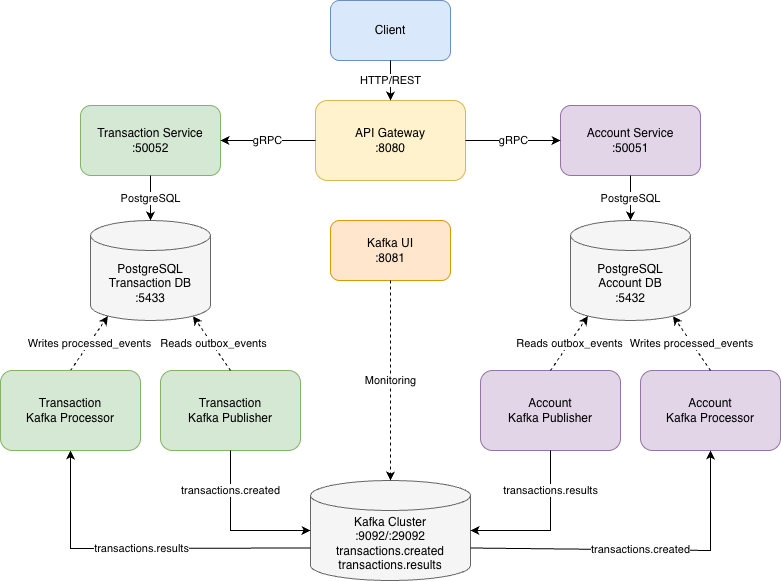

### архитектура бэкенда


### .env для локального запуска
```dotenv
ACCOUNT_SERVICE_POSTGRES_USERNAME=bill_clinton
ACCOUNT_SERVICE_POSTGRES_PASSWORD=2001
TRANSACTION_SERVICE_POSTGRES_USERNAME=solid_snake
TRANSACTION_SERVICE_POSTGRES_PASSWORD=gv%R*uJBHI)J
```